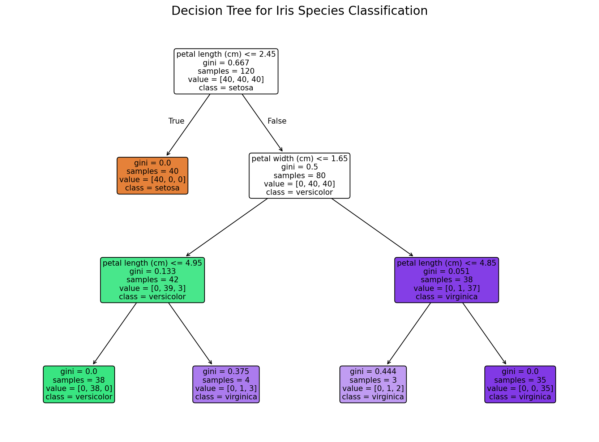
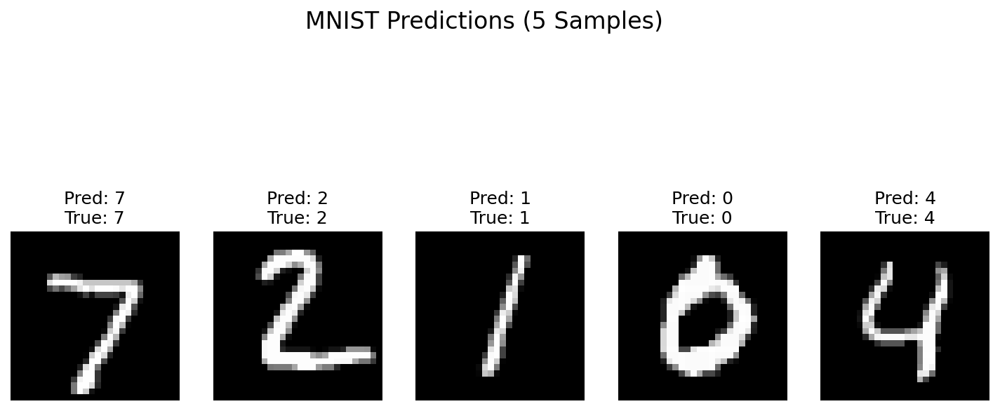
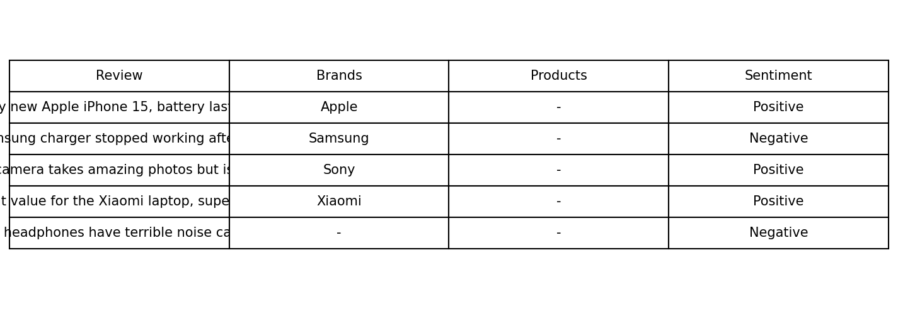

# AI Tools Assignment Report: Mastering the AI Toolkit

**Student:** Hayu Yonata  


---
## Part 1: Theoretical Understanding (40%)

### 1. Short Answer Questions

#### Q1: TensorFlow vs PyTorch
| Feature | TensorFlow | PyTorch |
|--------|------------|---------|
| Execution | Static + Dynamic | Dynamic |
| Debugging | Harder | Easier |
| Production | Excellent | Improving |
| Research | Less flexible | Preferred |

**Choose TF for production, PyTorch for research.**

#### Q2: Jupyter Use Cases
1. **EDA**: Visualize data, test preprocessing  
2. **Prototyping**: Build models step-by-step, teach AI

#### Q3: spaCy vs String Ops
| Task | Strings | spaCy |
|------|--------|-------|
| NER | Manual | Pre-trained |
| Speed | Slow | 10x faster |
| Accuracy | Low | High |

**spaCy = professional NLP, strings = basic**

---

### 2. Scikit-learn vs TensorFlow
| Criteria | Scikit-learn | TensorFlow |
|--------|--------------|------------|
| Target | Classical ML | Deep Learning |
| Ease | Very easy | Steeper |
| Community | Excellent | Huge (DL-focused) |

**Use Scikit-learn for Iris, TensorFlow for MNIST.**


## Part 2: Practical Implementation (50%)

### Task 1: Iris Classification
- **Accuracy**: `1.000`  
- **Precision/Recall**: `1.000`  
- **Model**: Decision Tree  



---

### Task 2: MNIST CNN
- **Test Accuracy**: `98.85%`  
- **Architecture**: 2 Conv + 2 Pooling + Dense  
- **5 Correct Predictions**  



---

### Task 3: NLP with spaCy
- **NER**: Apple, Samsung, Sony, Xiaomi, Bose  
- **Sentiment**: Rule-based  
- **Table Output**  



---

## Part 3: Ethics & Optimization (10%)

| Risk | Fix |
|------|-----|
| MNIST fails on rotated/noisy digits | `ImageDataGenerator(rotation_range=20, width_shift_range=0.1)` |
| NER misses "AirPods" | `Matcher` rule: `[{"LOWER": "airpods"}]` |
| Overfitting | `Dropout(0.5)` |

**Bug Fix**:
```python
# Wrong
model.compile(loss='categorical_crossentropy')
# Fixed
model.compile(loss='sparse_categorical_crossentropy')